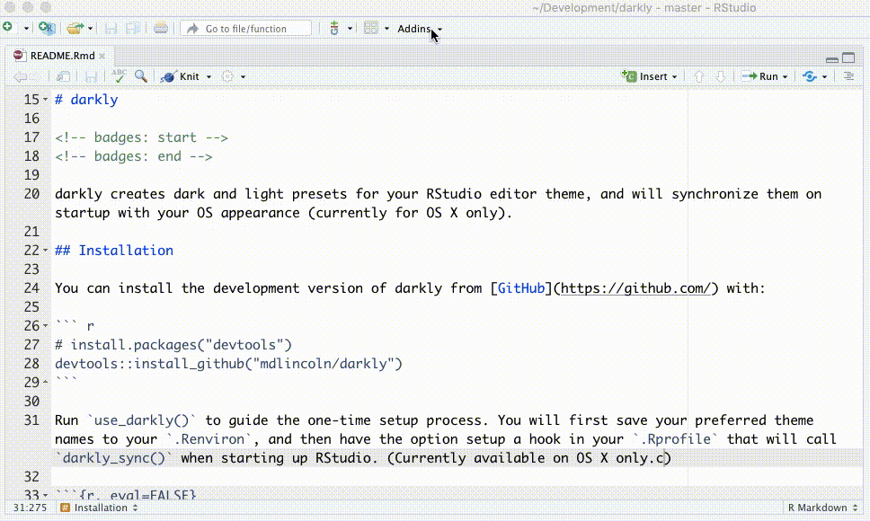

# darkly

<!-- badges: start -->
[](https://www.tidyverse.org/lifecycle/#experimental)
[](https://travis-ci.org/mdlincoln/darkly)
<!-- badges: end -->

darkly creates dark and light presets for your RStudio editor theme, and will synchronize them on startup with your OS appearance (currently for OS X only).

## Installation

You can install the development version of darkly from [GitHub](https://github.com/) with:

```r
# install.packages("devtools")
devtools::install_github("mdlincoln/darkly")
```

Run `use_darkly()` to guide the one-time setup process. You will first save your preferred theme names to your `.Renviron`, and then have the option setup a hook in your `.Rprofile` that will call `darkly_sync()` when starting up RStudio. (Currently available on OS X only.c)

```r
darkly::use_darkly()
#> ● Paste the following lines into your .Renviron
#>   DARKLY_LIGHT_THEME=Textmate (default)
#>   DARKLY_DARK_THEME=Solarized Dark
#>   [Copied to clipboard]
#> ● Modify '/Users/admin/.Renviron'
#> ● Restart R for changes to take effect

#> ● Paste the following line into your Rprofile
#>   # On load, synchronize the RStudio editor theme to the OS appearance using the darkly package
#>   setHook("rstudio.sessionInit", function(newSession) if (require("darkly", quietly = TRUE)) darkly::darkly_sync(), #> action = "append")
#>   [Copied to clipboard]
#> ● Modify '/Users/admin/.Rprofile'
#> ● Restart R for changes to take effect
```

darkly also includes RStudio addins to quickly toggle themes:



